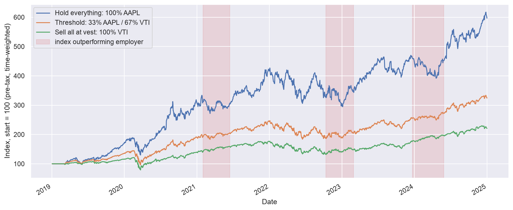
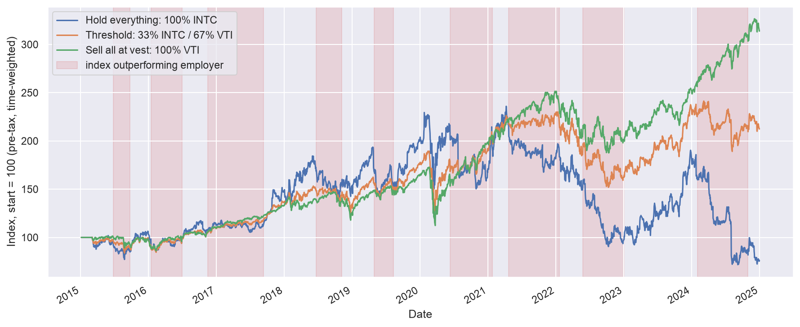

# rsu-rebalancing

[](https://github.com/tabishm52/rsu_rebalancing/actions/workflows/ci.yml)

Like many in the Bay Area, I've had the good fortune of receiving RSU compensation at a large,
growing public company, and as such I've had to consider the high-class "problem" of whether and how
to diversify a concentrated single-stock position. People approach this in different ways: on one
end of the spectrum, you have the financial advisor types who push maximum diversification and on
the other, the HODL'ers who are in a mild panic every time the company stock has a bad spell.

Most folks fall somewhere in between, and I've heard a variety of approaches. Typically, the
approach is pretty ad-hoc, selling chunks of stock here and there and otherwise using employer stock
as a piggy-bank for larger cash needs. I wanted an approach that was more principled, and I
eventually settled on a pretty simple rebalancing method. I've often wondered how well that approach
performed, and this project attempts to answer that question.

> **Not investment advice.** This is a historical simulation for curiosity and learning. Past
> performance does not predict future results, and the model omits real-world details such as wash
> sales, tax brackets, dividends as cash, transaction costs, and slippage.

## Diversification strategy

Each year, I would receive an annual refresher grant of RSUs denominated in dollars (~proportional
to my salary). Its dollar value was converted into a share count at the grant date, and then those
shares would vest over the following four years. Because the share count is locked at grant, the
*dollars* delivered at each vest float with the share price. If the stock has appreciated, the grant
over-delivers, which is wonderful but concentrates you even further in employer stock.

My diversification approach was a **one-way threshold rebalancing** strategy. Once or twice per
quarter — typically shortly after the trading window opened and again just before the next blackout
period — I would calculate what fraction of my *total* stock holdings were in employer stock. If
that exceeded a threshold (e.g., 33%), then I would sell my excess employer stock down to that
threshold and buy a diversified index with the proceeds. It was a *one-way* rebalance only; since I
expected future vesting, I would only ever sell employer stock, never buy it.

It's a simple strategy, but I found it had some nice benefits. First and perhaps most importantly,
my selling decisions were entirely mechanical. I did a quick calculation, and then I sold a specific
amount of stock, which took much of the emotion and FOMO out of it. Second, like any rebalancing
approach, the strategy naturally enforces buy low, sell high discipline. You sell **more** stock
when your employer outperforms the market and you sell **less** (or hold) when it lags. In practice,
annual vesting would almost always trigger a sale, and in between, the rebalancing rule would only
trigger a sale if my employer's stock had significant appreciation relative to the broader market.

## Project overview

This project backtests the one-way threshold rebalancing strategy. It is built as a small Python
package for the backtest engine plus an interactive [marimo](https://marimo.io) notebook front-end.

The backtest engine runs a strategy through the desired time window to calculate risk and return
characteristics of the strategy. The engine implements a simplified model of the impact of vesting
schedules and taxes upon vesting and sale events. It idealizes many other details, e.g. it assumes
instantaneous conversion from employer stock to index with fractional stock and zero transaction
costs.

The output of the backtest compares three strategies:

| Strategy | What it does |
| --- | --- |
| **Hold everything** | Never sell — maximum concentration. |
| **Threshold N%** | The target strategy — trim employer stock to N% on each rebalance day. |
| **Sell all at vest** | Convert every grant straight to the index — full diversification. |

## Example outputs

Both runs below use the notebook defaults — VTI as the diversified index, 2015–2024 date range, the
same nominal grant values and tax rates — and differ only in the employer stock. In the figures,
each line is the time-weighted return under one strategy, and the shaded bands mark stretches where
the index out-returned the employer.

### How returns are measured

Because grants add money over time and tax payments behave as a withdrawal, raw portfolio value is
**not** a clean return series — a jump on a grant day is a deposit, not market performance. Risk and
return here use a **time-weighted return** that strips out each day's non-market inflows and
outflows (`metrics.time_weighted_returns`). Final dollar value is still reported directly and is a
fair head-to-head number because every strategy receives the identical grant stream.

### When the employer beats the market (AAPL)



<!-- BEGIN summary:aapl (generated by assets/generate_assets.py — do not edit by hand) -->

| Metric | Hold everything | Threshold 33% | Sell all at vest |
| --- | ---: | ---: | ---: |
| Final portfolio value | $5,013,119 | $3,028,989 | $2,361,184 |
| Liquidation value (net of tax) | $3,935,447 | $2,515,807 | $2,031,562 |
| Vested contributions (net of tax) | $1,196,107 | $1,196,107 | $1,196,107 |
| Taxes paid | $939,798 | $971,100 | $939,798 |
| Annualized return (TWR) | 24.17% | 16.68% | 12.14% |
| Annualized volatility | 28.21% | 19.96% | 17.90% |
| Max drawdown | -38.52% | -33.58% | -35.00% |
| Sharpe ratio | 0.84 | 0.77 | 0.62 |
| End employer % | 100.0% | 37.7% | 0.0% |

<!-- END summary:aapl -->

Over this window AAPL beat the market, so holding everything won outright on final dollars, but it
rode the most volatility and the deepest drawdown to get there. Even for a high-flying stock like
AAPL, there were periods of time that the stock underperformed the index. The 33% threshold strategy
gave up much of the single-stock upside in exchange for diversification and downside protection and
came out ahead of full diversification on both raw and risk-adjusted return.

### When the employer lags the market (INTC)



<!-- BEGIN summary:intc (generated by assets/generate_assets.py — do not edit by hand) -->

| Metric | Hold everything | Threshold 33% | Sell all at vest |
| --- | ---: | ---: | ---: |
| Final portfolio value | $422,481 | $1,139,915 | $1,685,398 |
| Liquidation value (net of tax) | $422,481 | $980,578 | $1,429,610 |
| Vested contributions (net of tax) | $780,527 | $780,527 | $780,527 |
| Taxes paid | $613,272 | $616,946 | $613,272 |
| Annualized return (TWR) | -2.69% | 7.84% | 12.14% |
| Annualized volatility | 35.53% | 20.99% | 17.90% |
| Max drawdown | -69.57% | -33.96% | -35.00% |
| Sharpe ratio | 0.05 | 0.37 | 0.62 |
| End employer % | 100.0% | 18.8% | 0.0% |

<!-- END summary:intc -->

Intel is the mirror image: over the same window it lagged the market badly, so concentration was
punished instead of rewarded. Full diversification wins here, and the threshold strategy again lands
in between, keeping most assets protected by diversification while holding a slice of employer
exposure.

The charts and tables above are regenerated from the notebook defaults by
[assets/generate_assets.py](assets/generate_assets.py).

## Install

Requires [uv](https://docs.astral.sh/uv/).

```bash
uv sync --extra dev
```

## Quickstart

### Interactive notebook

```bash
uv run marimo edit notebooks/rsu_backtest.py
```

Set the employer/index tickers, date window, grant size and growth, and threshold to run a strategy.
The backtest re-runs reactively as you edit settings to produce charts (employer concentration over
time, growth of the three strategies), a return/risk comparison table, and the threshold strategy's
trade log. The various settings exposed in the notebook are documented below.

### From Python

```python
from rsu_rebalancing import (
    BacktestConfig,
    GrantConfig,
    StrategyConfig,
    comparison_table,
    run_backtest,
)

strategy = StrategyConfig(employer_ticker="AAPL", index_ticker="VTI", threshold=0.33)
grants = GrantConfig(grant_dollars=100_000, start_year=2011, end_year=2024)
backtest = BacktestConfig(start="2015-01-01", end="2024-12-31", risk_free_rate=0.02)

results = run_backtest(strategy, grants, backtest)
print(
    comparison_table(
        results,
        risk_free_rate=backtest.risk_free_rate,
        after_tax=backtest.after_tax_performance,
    )
)
```

The above Python code mirrors the notebook's AAPL defaults and should produce the summary table
shown above. An important detail in the config is that the grant years extend earlier than the
backtest years — see the parameters section below for more explanation.

## Parameters

These are the knobs the notebook exposes, in the same two groups it uses: the everyday ones up top,
the fussy details under "Extra settings". Each maps to a field on one of the config dataclasses for
the Python API. For additional details and a few settings that are not exposed to the notebook, see
the dataclass docstrings in [src/rsu_rebalancing/config.py](src/rsu_rebalancing/config.py).

### Main knobs

- **Employer / index ticker** (`StrategyConfig.employer_ticker`, `index_ticker`): The concentrated
  stock and the diversified fund its proceeds buy.
- **Start / end date** (`BacktestConfig.start`, `end`): The backtest window.
- **First-year grant $** (`GrantConfig.grant_dollars`): The **gross** award value in the window's
  first year, priced into a share count at the award date.
- **Grant growth %/yr** (`GrantConfig.grant_growth_rate`): Annual nominal growth of the award value,
  modeling wage inflation; compounds off the window's first year.
- **Rebalance threshold %** (`StrategyConfig.threshold`): Target maximum employer fraction;
  rebalances trim employer stock down to it.
- **Analyze performance after tax** (`BacktestConfig.after_tax_performance`): Toggles return/risk
  calculations between raw market value and net-of-tax liquidation value.

### Extra settings

- **Backfill grants before window**: Starts the award stream `vesting_years` before the window so
  year one of the backtest opens at steady state (a mature employee with established grants, not a
  new hire building up a series of grants). In the Python API this translates to setting
  `GrantConfig.start_year` that many years before `BacktestConfig.start`.
- **Vesting years** (`GrantConfig.vesting_years`): Equal annual tranches each award vests over.
- **Rebalances per quarter** (`StrategyConfig.rebalances_per_quarter`): How many evenly spaced
  rebalance dates to place in each quarter.
- **Hysteresis band %** (`StrategyConfig.rebalance_band`): A one-way band; a rebalance fires only
  when the employer fraction exceeds `threshold + band`.
- **Vest withholding %** (`TaxConfig.ordinary_income_rate`): Tax rate for each vesting event via
  sell-to-cover, grossing the kept share count down.
- **Short- / long-term cap-gains tax %** (`TaxConfig.short_term_rate`, `long_term_rate`): Tax rates
  for gains on employer-stock sales by holding period.
- **Risk-free % (for Sharpe)** (`BacktestConfig.risk_free_rate`): Used only for calculation of the
  Sharpe ratio.

## Data & caching

Share prices come from [yfinance](https://github.com/ranaroussi/yfinance) with an adjusted close, so
splits and dividends are handled. Fetches are memoized in-memory for the session, so that moving a
slider in the notebook doesn't re-hit the network.

## Development

```bash
uv run pytest -q                                     # tests (no network needed)
uv run ruff check . && uv run ruff format --check .  # lint + format
uv run pyright                                       # type check
```

See [CLAUDE.md](CLAUDE.md) for the project layout and conventions.

## License

MIT
